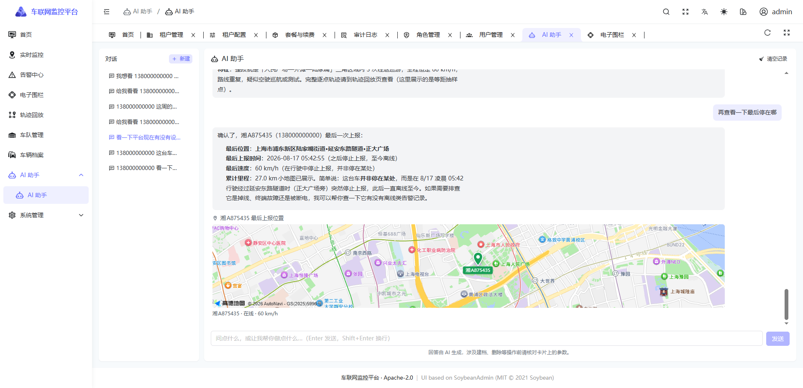
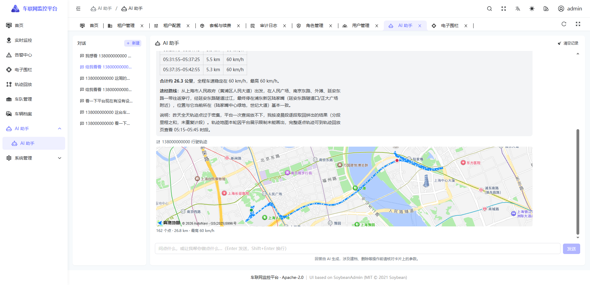
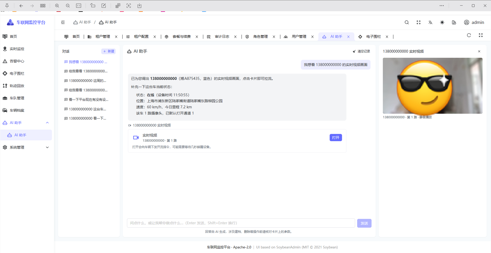
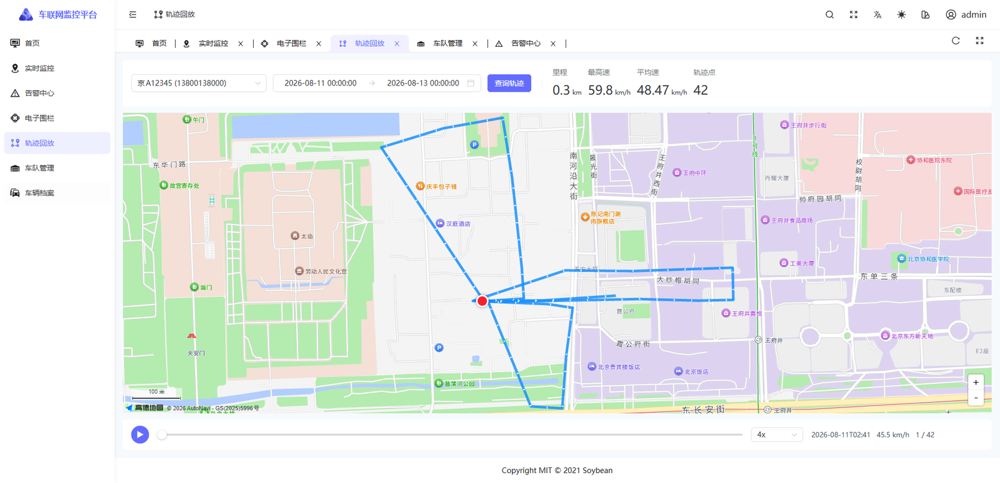
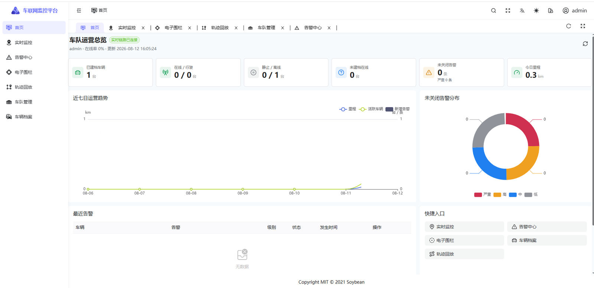

# JT Vehicle Platform

[](LICENSE)
[](https://adoptium.net/)
[](https://spring.io/projects/spring-boot)
[](https://vuejs.org/)

**A ready-to-run vehicle monitoring platform for the Chinese national standards
JT/T 808 (telematics protocol) and JT/T 1078 (video protocol).**

[中文文档](README.md)

Terminals connect over JT/T 808, push video over JT/T 1078, and you get live maps,
live video and historical playback in the browser — **with no Redis, no message
queue and no external business system required**.

```bash
docker compose up -d --build     # then open http://localhost
```

### AI assistant: ask in plain language, get the answer drawn

Ask anything about the data, or have it create vehicles, geofences and handle alarms.
**Answers are not just text** — positions, routes and trends render right inside the conversation,
and the input box stays usable so you can keep asking while looking.

Ask where a vehicle is, and the map appears under the answer:



Ask for yesterday's route, and you get the polyline, endpoints, distance and top speed:



Video gets a card instead of an automatic stream — **opening a stream sends a command to a vehicle
out on the road, so a human clicks that**. It plays in the side panel while the conversation stays live:



Anything that changes data goes through a confirmation card. The assistant can only **propose**;
execution happens in the browser with the signed-in user's own token against the existing APIs,
so permissions, data scope and audit all run through the paths they already did.

### Track playback

Query historical tracks by vehicle and time range, draw the route on the map and
replay it at 1x–16x, with distance, top speed, average speed and point count.
Terminals report WGS-84 coordinates, which are converted to GCJ-02 on ingest, so
the route lines up with the Chinese map tiles instead of being offset.



### Fleet dashboard

Registered vehicles, online/moving, idle/offline, unregistered-but-online,
open alarms and daily distance, plus a seven-day trend, alarm severity breakdown
and the latest alarm activity.



## What it is for

JT/T 808 and JT/T 1078 are mandatory standards for commercial vehicle monitoring in
China. Building on them normally means dealing with message fragmentation and byte
escaping, raw H.264 stream reassembly, the mismatch between terminal IDs and SIM
numbers, and in-browser video decoding. This project has already worked through
those problems.

```
Vehicle terminal ──JT/T 808/1078──▶ Gateway ──HTTP delivery──▶ Backend ──REST/WS──▶ Console UI
                                       │                       (SQLite)              │
                                       └──────── raw-stream WebSocket ───────────────┘
```

| Module | Responsibility | Default ports |
|---|---|---|
| `jt-platform` | JT/T 808 signalling, JT/T 1078 media ingest, stream scheduling, event delivery | `7100`, `7101`, `7810-7815`, `8100`, `8109` |
| `jt-console` | Auth, vehicles/tracks/status, fleet analytics, alarms, geofences, stream proxy | `8300` |
| `jt-console-ui` | Dashboard, live monitoring, alarm handling, geofences, track playback, video | `9527` (dev) / `443` (deployed) |
| `packages/jt-player` | Browser raw-stream player SDK, zero runtime dependencies, Vue 3 + React adapters | — |
| `jt-terminal-simulator` | Simulates a JT/T 808 terminal with your webcam, so you can test without a real device | desktop app |

Stack: JDK 25 · Spring Boot 4.1 · Netty · Vue 3 · SQLite.

## Features

- JT/T 808 (2011 / 2013 / 2019), JT/T 1078 and the JSATL12 active-safety extension
- H.264, H.265, AAC and G.711A media ingest on separate ports for main stream,
  sub stream, playback and talkback
- Two-phase stream opening with one-time media tokens; clients connect directly to
  the scheduled media node
- Raw-stream WebSocket playback, exclusive or mixed talkback, segmented recording,
  search, playback and offline MP4 export
- Protocol event delivery over HTTP API and/or RocketMQ, with idempotency,
  back-pressure and ordering guarantees per device
- Fleet dashboard, alarm lifecycle (dedupe / acknowledge / close), GCJ-02 circular
  geofences with enter-exit and in-fence speed limits
- AI assistant for querying and operating the platform in natural language: streaming replies,
  conversations that survive a refresh, and data changes always confirmed by the user
- AI answers embed live position, driving tracks, charts and live video; views with real-world
  side effects (opening a stream) always require an explicit click
- One executable JAR runs either `standalone` or split `api` / `signal` / `media` roles

## Quick start

```bash
git clone https://github.com/liuxiaoyan199701-coder/jt-vehicle-platform.git
cd jt-vehicle-platform
docker compose up -d --build

# the admin password is generated per start and printed to the log
docker compose logs console | grep "jt-console]"
```

Open **http://localhost**.

> **Use `localhost`, not an IP.** Video playback relies on the browser's WebCodecs
> API, which is only exposed in a secure context. `http://localhost` qualifies;
> any other host requires HTTPS or video will not decode.
>
> For **real terminals**, also set the address they can reach:
> ```bash
> MEDIA_REACHABLE_ADDRESS=192.168.1.10 docker compose up -d
> ```
> This address is written into the 9101/9201 commands sent to terminals — a
> container-internal IP is not routable for them.

The Compose setup targets local evaluation: device auth is `allow-all`, stream auth
is disabled and traffic is plain HTTP. For production use the scripts under
`deploy/`, which provide checksum verification, blue-green releases and automatic
rollback.

## Documentation

- [Deployment guide](docs/deployment.md)
- [Protocol message coverage](docs/protocol-message-coverage.md)
- [Raw recording format](docs/recording-format.md)
- [Stream-open JWT contract](docs/jwt-auth-contract.md)
- [Terminal simulator](docs/terminal-simulator.md)
- [Player SDK](packages/jt-player/README.md)

## Acknowledgements

This project stands on:

| Upstream | License | Where it is used |
|---|---|---|
| [yezhihao/jt808-server](https://github.com/yezhihao/jt808-server) | Apache-2.0 | protocol model and codecs, original `org.yzh.**` packages retained |
| [jt1078-stream-server](https://gitee.com/lxygit0731/jt1078-stream-server) | MIT | media ingest/distribution in `jt-platform/jt-media`, and `packages/jt-player` — rewritten from this project's own earlier work by the same author |
| [SoybeanAdmin](https://github.com/soybeanjs/soybean-admin) v2.2.0 | MIT © 2021 Soybean | layout, theming, routing and request layer of `jt-console-ui` |

See [NOTICE](NOTICE) for the complete third-party inventory and license boundaries.
Map rendering uses the [AMap](https://lbs.amap.com) JavaScript API, a commercial
service that requires your own key — no AMap code is bundled here.

## License

[Apache License 2.0](LICENSE). Apache-2.0 was chosen because the project contains
Apache-2.0 derived code, which cannot be relicensed under more permissive terms;
MIT-licensed code can legally be combined into it. Sub-directories keep their
original license files.

## Contributing

Issues and pull requests are welcome — see [CONTRIBUTING.md](CONTRIBUTING.md).
The most valuable contributions usually come from problems found while integrating
real vehicle terminals.
